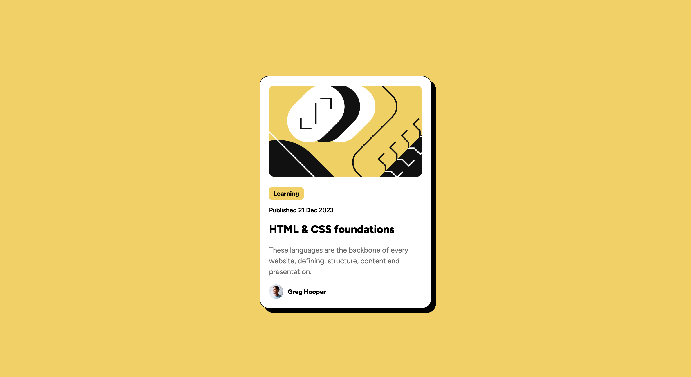

# Frontend Mentor - Blog preview card solution

This is a solution to the [Blog preview card challenge on Frontend Mentor](https://www.frontendmentor.io/challenges/blog-preview-card-ckPaj01IcS). 

## Table of contents

- [Overview](#overview)
  - [The challenge](#the-challenge)
  - [Screenshot](#screenshot)
  - [Links](#links)
- [My process](#my-process)
  - [Built with](#built-with)
  - [What I learned](#what-i-learned)
  - [Continued development](#continued-development)
- [Author](#author)
- [Acknowledgments](#acknowledgments)

## Overview

### The challenge

Users should be able to:

- See hover and focus states for all interactive elements on the page (only header in this case)

### Screenshot



### Link

- Live Site URL: [https://veyronshark.github.io/Blog-preview-card-solution/](https://veyronshark.github.io/Blog-preview-card-solution/)

## My process

### Built with

- Semantic HTML5 markup
- Flexbox


### What I learned

While making this solution I learnt about box-shadows and nested css which looks neater on my code

This is what is was:
```css
h1 {
  font-weight: 800;
  font-size: 24px;
}
h1:hover {
  color: #F6D050;
  cursor: pointer;
}
h1:active {
  text-decoration: underline;
}
```

This is what is became:
```css
h1 {
  font-weight: 800;
  font-size: 24px;

  &:hover {
    color: #F6D050;
    cursor: pointer;
  }

  &:active {
    text-decoration: underline;
  }
}
```

### Continued development

I will continue to use and understand box shadow and the rgba color picker

## Author

- Frontend Mentor - [@VeyronShark](https://www.frontendmentor.io/profile/VeyronShark)

## Acknowledgments

I send my regards to [freeCodeCamp](https://www.freecodecamp.org) and [Colt Steele](https://www.udemy.com/user/coltsteele/?srsltid=AfmBOop0NGbVNsQdQFTNI0qbD03-TLUUHoXJpW2wvThgUzgP0JtBKV-d) who taught me concepts to tackle this problem. It was a simple one but it is a start
